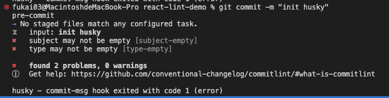
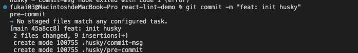

# react-lint-demo

代码规范学习 demo

### CRA 搭建项目

- 创建 lint-demo 项目

```bash
npx create-react-app lint-demo --template typescript
```

- 在 lint-demo 项目中安装`craco`。这是由于使用 `create-react-app` 创建的项目默认是无法修改其内部的 webpack 配置的,所以使用 `craco` 覆盖配置。[craco 官方库](https://github.com/dilanx/craco)

```bash
npm install --save @craco/craco
```

- 根路径下创建配置文件`craco.config.js`，并进行一下配置。

```js
const path = require('path');
const { name } = require('./package.json');

const pathResolve = pathUrl => path.join(__dirname, pathUrl);

module.exports = {
  reactScriptsVersion: 'react-scripts' /* (default value) */,
  webpack: {
    alias: {
      '@': pathResolve('src'),
      '@assets': pathResolve('src/assets'),
      '@components': pathResolve('src/components'),
      '@constants': pathResolve('src/constants'),
      '@containers': pathResolve('src/containers'),
      '@hooks': pathResolve('src/hooks'),
      '@mocks': pathResolve('src/mocks'),
      '@routes': pathResolve('src/routes'),
      '@services': pathResolve('src/services'),
      '@styles': pathResolve('src/styles'),
      '@types': pathResolve('src/types'),
      '@utils': pathResolve('src/utils'),
      '@contexts': pathResolve('src/contexts'),
    },
    configure(webpackConfig) {
      // 配置扩展扩展名
      webpackConfig.resolve.extensions = [...webpackConfig.resolve.extensions, ...['.scss', '.css']];
      // 接入微前端框架qiankun的配置,不接入微前端可以不需要
      webpackConfig.output.library = `${name}-[name]`;
      webpackConfig.output.libraryTarget = 'umd';
      webpackConfig.output.globalObject = 'window';
      return webpackConfig;
    },
  },
  devServer: {
    // 本地服务的端口号
    port: 3001,
    // 本地服务的响应头设置
    headers: {
      // 允许跨域
      'Access-Control-Allow-Origin': '*',
    },
  },
};

```

- 根据官方文档修改`package.json`中的`scripts`命令

```json
"scripts": {
    "start": "craco start",
    "build": "craco build",
    "test": "craco test"
},
```

### 集成 ESLint

> ESLint 是一个在 JavaScript 代码中通过规则模式匹配作代码识别和报告的插件化的检测工具，它的目的是保证代码规范的一致性和及时发现代码问题、提前避免错误发生。 ESLint 的关注点是代码质量，检查代码风格并且会提示不符合风格规范的代码

- 安装

```bash
npm install eslint --save-dev
```

- 由于项目是 React+TS，所以还需额外安装插件和解析器
  - 安装 eslint-plugin-react 配置包扩展支持 React 语法
  - 安装 @typescript-eslint/parser，替代掉默认的 Espree 解析器
  - 安装@typescript-eslint/eslint-plugin 提供额外的 ts 语法的规则

```bash
npm install --save-dev eslint-plugin-react @typescript-eslint/parser @typescript-eslint/eslint-plugin
```

- 创建配置文件，可直接在根路径创建`.eslintrc.js`文件,并修改文件。或者在终端中输入如下命令`npx eslint--init`并根据提示自动创建配置文件.[具体配置见](./lint-demo/.eslintrc.js)

### 集成 Prettier

> Prettier 是一个诞生于 2016 年就迅速流行起来的专注于代码格式化的工具。只关注格式化，并不具有 lint 检查语法等能力。它通过解析代码并匹配自己的一套规则，来强制执行一致的代码展示格式。 它在美化代码方面有很大的优势，配合 ESLint 可以对 ESLint 格式化基础上做一个很好的补充。

- 安装

```bash
npm install prettier --save-dev
```

- 根路径下新建`.prettierrc.js`文件并配置

```js
module.exports = {
    // 1.一行代码的最大字符数，默认是80(printWidth: <int>)
    printWidth: 120,
    // 2.tab宽度为2空格(tabWidth: <int>)
    tabWidth: 2,
    // 3.是否使用tab来缩进，我们使用空格(useTabs: <bool>)
    useTabs: false,
    // 4.结尾是否添加分号，false的情况下只会在一些导致ASI错误的其工况下在开头加分号，我选择无分号结尾的风格(semi: <bool>)
    semi: true,
    // 5.使用单引号(singleQuote: <bool>)
    singleQuote: true,
    // 6.object对象中key值是否加引号（quoteProps: "<as-needed|consistent|preserve>"）as-needed只有在需求要的情况下加引号，consistent是有一个需要引号就统一加，preserve是保留用户输入的引号
    quoteProps: 'as-needed',
    // 7.在jsx文件中的引号需要单独设置（jsxSingleQuote: <bool>）
    jsxSingleQuote: false,
    // 8.尾部逗号设置，es5是尾部逗号兼容es5，none就是没有尾部逗号，all是指所有可能的情况，需要node8和es2017以上的环境。（trailingComma: "<es5|none|all>"）
    trailingComma: 'es5',
    // 9.object对象里面的key和value值和括号间的空格(bracketSpacing: <bool>)
    bracketSpacing: true,
    // 10.jsx标签多行属性写法时，尖括号是否另起一行(jsxBracketSameLine: <bool>)
    jsxBracketSameLine: false,
    // 11.箭头函数单个参数的情况是否省略括号，默认always是总是带括号（arrowParens: "<always|avoid>"）
    arrowParens: 'avoid',
    // 12.range是format执行的范围，可以选执行一个文件的一部分，默认的设置是整个文件（rangeStart: <int>  rangeEnd: <int>）
    rangeStart: 0,
    rangeEnd: Infinity,
    // 18. vue script和style标签中是否缩进,开启可能会破坏编辑器的代码折叠
    vueIndentScriptAndStyle: false,
    // 19.    endOfLine: "<lf|crlf|cr|auto>" 行尾换行符,默认是lf,
    endOfLine: 'auto',
    // 20.embeddedLanguageFormatting: "off",默认是auto,控制被引号包裹的代码是否进行格式化
    embeddedLanguageFormatting: 'off',
};

```

#### 解决 Prettier 和 ESLint 配置冲突问题

> 在代码格式化时采用 Perttier 规则，而代码校验使用的是 ESLint，如果同一个规则配置不一致，往往就会出现冲突问题
> 冲突问题一般有一下解决方法：

- 修改 eslintrc，或修改 prettierrc 配置，让它们配置保持一致
- 禁用 ESLint 中和 Prettier 配置有冲突的规则；再使用 Prettier 来替代 ESLint 的格式化功能

安装 eslint-config-prettier 插件配置集，把其配置到 eslintrc 规则的尾部。执行 eslint 命令，会禁用那些和 Prettier 配置有冲突的规则。
安装 eslint-plugin-prettier 插件，先使用 Prettier 对代码进行格式化，再并对不一致的地方进行标记；
这两个包配合使用，可以达到运行 eslint --fix 时，采用 Prettier 的配置规则 来格式化文件。

### 集成 husky

[官网](https://typicode.github.io/husky/#/)

> husky 是一个为 git 客户端增加 hook 的工具。安装后，它会自动在仓库中的 .git/ 目录下增加相应的钩子；比如 pre-commit 钩子就会在你执行 git commit 的触发。
> 作用：

- 可以在 pre-commit 中实现一些比如 lint 检查、单元测试、代码美化等操作。
- 可以在 commit-msg 钩子中结合 commitlint 实现提交信息的检查

#### githooks

> Git Hooks 就是在 Git 执行特定事件（如 commit、push、receive 等）时触发运行的脚本，类似于“钩子函数”，没有设置可执行的钩子将被忽略。
> git hook 的作用是在 git 动作发生前后触发自定义脚本。这些动作包括提交，合并，推送等，我们可以利用这些钩子在 git 流程的各个环节实现自己的业务逻辑。

#### 初始化 husky

- 使用 `husky-init` 进行快速初始化

```bash
npx husky-init && npm install       # npm
npx husky-init && yarn              # Yarn 1
yarn dlx husky-init --yarn2 && yarn # Yarn 2+
pnpm dlx husky-init && pnpm install # pnpm
```

#### 安装 lint-staged

```bash
npm i lint-staged -D
pnpm add lint-staged -D
yarn add lint-staged -D
```

#### 安装 commitlint

- 安装

```bash
pnpm add --save-dev @commitlint/{cli,config-conventional}
```

- 根路径新建 commitlint.config.js 文件并配置

```js
module.exports = {
  parserPreset: 'conventional-changelog-conventionalcommits',
  rules: {
    'body-leading-blank': [1, 'always'],
    'body-max-line-length': [2, 'always', 100],
    'footer-leading-blank': [1, 'always'],
    'footer-max-line-length': [2, 'always', 100],
    'header-max-length': [2, 'always', 100],
    'subject-case': [2, 'never', ['sentence-case', 'start-case', 'pascal-case', 'upper-case']],
    'subject-empty': [2, 'never'],
    'subject-full-stop': [2, 'never', '.'],
    'type-case': [2, 'always', 'lower-case'],
    'type-empty': [2, 'never'],
    'type-enum': [
      2,
      'always',
      ['build', 'chore', 'ci', 'docs', 'feat', 'fix', 'perf', 'refactor', 'revert', 'style', 'test'],
    ],
  },
  prompt: {
    questions: {
      type: {
        description: "Select the type of change that you're committing",
        enum: {
          feat: {
            description: 'A new feature',
            title: 'Features',
            emoji: '✨',
          },
          fix: {
            description: 'A bug fix',
            title: 'Bug Fixes',
            emoji: '🐛',
          },
          docs: {
            description: 'Documentation only changes',
            title: 'Documentation',
            emoji: '📚',
          },
          style: {
            description:
              'Changes that do not affect the meaning of the code (white-space, formatting, missing semi-colons, etc)',
            title: 'Styles',
            emoji: '💎',
          },
          refactor: {
            description: 'A code change that neither fixes a bug nor adds a feature',
            title: 'Code Refactoring',
            emoji: '📦',
          },
          perf: {
            description: 'A code change that improves performance',
            title: 'Performance Improvements',
            emoji: '🚀',
          },
          test: {
            description: 'Adding missing tests or correcting existing tests',
            title: 'Tests',
            emoji: '🚨',
          },
          build: {
            description:
              'Changes that affect the build system or external dependencies (example scopes: gulp, broccoli, npm)',
            title: 'Builds',
            emoji: '🛠',
          },
          ci: {
            description:
              'Changes to our CI configuration files and scripts (example scopes: Travis, Circle, BrowserStack, SauceLabs)',
            title: 'Continuous Integrations',
            emoji: '⚙️',
          },
          chore: {
            description: "Other changes that don't modify src or test files",
            title: 'Chores',
            emoji: '♻️',
          },
          revert: {
            description: 'Reverts a previous commit',
            title: 'Reverts',
            emoji: '🗑',
          },
        },
      },
      scope: {
        description: 'What is the scope of this change (e.g. component or file name)',
      },
      subject: {
        description: 'Write a short, imperative tense description of the change',
      },
      body: {
        description: 'Provide a longer description of the change',
      },
      isBreaking: {
        description: 'Are there any breaking changes?',
      },
      breakingBody: {
        description: 'A BREAKING CHANGE commit requires a body. Please enter a longer description of the commit itself',
      },
      breaking: {
        description: 'Describe the breaking changes',
      },
      isIssueAffected: {
        description: 'Does this change affect any open issues?',
      },
      issuesBody: {
        description:
          'If issues are closed, the commit requires a body. Please enter a longer description of the commit itself',
      },
      issues: {
        description: 'Add issue references (e.g. "fix #123", "re #123".)',
      },
    },
  },
};
```

- 修改.husky/commit -msg 文件

```shell
#!/usr/bin/env sh
. "$(dirname -- "$0")/_/husky.sh"

npx --no-install commitlint --edit "$1"
```

- 配置完成后，进行 git commit，如下图，可以看出不符合提交规范，报错

```
git commit -m "init husky"
```



- 修改后

```bash
git commit -m "feat: init husky"
```


